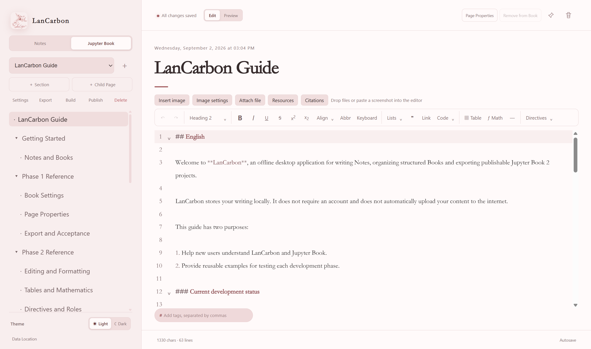

<p align="center"></p>
<h1 align="center">LanCarbon</h1>
<p align="center">An offline desktop application for writing Notes, creating structured Books, building Jupyter Book websites, and publishing them to GitHub Pages.</p>
<p align="center"><a href="https://github.com/Hao-jieDai/LanCarbon/releases/latest"><strong>Download the latest release</strong></a> · <a href="#english">English</a> · <a href="#中文">中文</a></p>



<a id="english"></a>

## English

### What is LanCarbon?

LanCarbon is a Windows desktop application for writing ordinary Markdown Notes and organizing longer work as Books with Sections and Child Pages. It keeps writing and managed resources on your computer. An account is not required for ordinary writing, and LanCarbon uploads content only when you explicitly use Publish.

Version 1.1.1 adds a safer, transparent Environment Setup assistant for optional Build and Publish tools. A new installation includes a pinned **ReadMe** Note and the complete bilingual **LanCarbon: From 0 to 1** tutorial Book. This system-managed tutorial is synchronized from the installed release on every upgrade; users should not edit it because changes are overwritten without a backup.

### Main features

- Offline Markdown Notes with search, tags, pinning and autosave.
- Structured Books with Sections, Child Pages, page properties and Book settings.
- CodeMirror editing, MyST-aware formatting tools and an offline Preview.
- Images, attachments, reusable Resources, BibTeX libraries and citations.
- Optional export of a separate Jupyter Book source copy.
- Managed local website builds with preflight checks and restart recovery.
- GitHub repository connection, GitHub Pages publishing and later website updates.
- Environment Setup with managed, independently repairable tools under the LanCarbon root.
- Light and Dark themes with the LanCarbon visual style.

### Download and install

Open [Releases](https://github.com/Hao-jieDai/LanCarbon/releases) and download `LanCarbon-1.1.1-x64-Setup.exe`. Ordinary users should download the installer, rather than GitHub's automatically generated source-code archives.

The installer supports 64-bit Windows. Its default root is `D:\LanCarbon`. You may choose another location, but a first-install destination must be an empty folder named `LanCarbon`. The installer creates:

```text
LanCarbon/
├─ Application/   Program files
├─ Data/          Notes, Books and managed resources
├─ Config/        Application and Book preferences
├─ Cache/         Re-creatable runtime cache
├─ Temp/          Temporary build and publishing files
├─ Builds/        Saved local websites
├─ Exports/       Default starting location for Export
└─ Tools/         Optional tools managed by Environment Setup
```

If the computer has no D drive, the installer uses a `LanCarbon` folder in the current Windows user's directory. Windows itself may still use system folders briefly for installer extraction, shortcuts, registry records and operating-system caches.

### Additional tools

Basic writing, Preview and source-copy Export work inside LanCarbon. Additional tools are required only for the corresponding workflow:

- **Build:** Python 3 and Jupyter Book 2.
- **Publish:** Git, GitHub CLI, a GitHub account and network access to GitHub.

LanCarbon checks these requirements in **Environment Setup**, introduced by the first-run ReadMe and available from the sidebar and from the Build and Publish panels. Compatible system installations are marked **Using existing** and do not show an install action. Missing or incompatible tools can be installed as private managed copies under `LanCarbon/Tools`; the Python action uses a portable archive and never changes a registered system Python. Downloads show live byte and percentage progress, are verified before deployment, and can be canceled with partial files removed. Failed downloads do not affect Notes, Books or tools already installed successfully.

If GitHub cannot be reached, enable the proxy application's system proxy or TUN mode and retry. The bundled *LanCarbon: From 0 to 1* Book explains managed and manual installation, writing, Build, GitHub sign-in, publication and common errors.

### Privacy and local data

LanCarbon stores the active workspace in the selected `Data` folder. It does not require a LanCarbon account or synchronize Notes automatically. Back up the whole LanCarbon root before moving to another computer or making major system changes.

### Development

Development requires Node.js 22.12 or newer. Jupyter Book 2 is also required for the complete build and end-to-end test suite.

```bash
npm install
npm run dev
```

```bash
npm run typecheck
npm test
npm run build
npm run test:e2e
npm run dist
```

The Windows installer is written to `release/`. Generated dependencies, builds, installers, caches and test output are excluded from Git.

### Support

Use [GitHub Issues](https://github.com/Hao-jieDai/LanCarbon/issues) to report reproducible problems or suggest improvements. Do not include passwords, GitHub tokens, private Book content or personal data in an issue.

---

<a id="中文"></a>

## 中文

### LanCarbon 是什么？

LanCarbon 是一款 Windows 桌面写作软件，既可以撰写普通 Markdown Notes，也可以通过 Sections 和 Child Pages 组织较长的 Books。正文和受管理资源保存在你的电脑上。普通写作不需要账号，只有在你明确使用 Publish 时，LanCarbon 才会上传内容。

1.1.1 新增更安全、过程透明的 Environment Setup 辅助安装助手，用于准备可选的 Build 与 Publish 工具。全新安装会自带一篇置顶的 **ReadMe** 笔记，以及完整的中英文双语教程 Book **LanCarbon: From 0 to 1**。这本系统管理教程会在每次软件升级时同步为当前安装版本；用户不应编辑，因为修改会被覆盖且不会创建备份。

### 主要功能

- 支持搜索、标签、置顶和自动保存的离线 Markdown Notes。
- 使用 Sections、Child Pages、Page Properties 和 Book Settings 组织 Books。
- CodeMirror 编辑器、MyST 格式工具和离线 Preview。
- 图片、附件、可重复使用的 Resources、BibTeX 文献库和 Citations。
- 按需导出独立的 Jupyter Book 源文件副本。
- 带预检和重启恢复的本地网站 Build。
- 连接 GitHub 仓库、发布到 GitHub Pages，并在以后更新网站。
- Environment Setup 可在 LanCarbon 根目录中独立安装和修复所需工具。
- 具有 LanCarbon 视觉风格的 Light 和 Dark 主题。

### 下载与安装

打开 [Releases](https://github.com/Hao-jieDai/LanCarbon/releases)，下载 `LanCarbon-1.1.1-x64-Setup.exe`。普通用户应下载安装程序，不要下载 GitHub 自动生成的 Source code 压缩包。

安装程序支持 64 位 Windows，默认根目录为 `D:\LanCarbon`。你也可以选择其他位置，但首次安装的目标必须是一个名为 `LanCarbon` 的空文件夹。安装后自动建立：

```text
LanCarbon/
├─ Application/   程序文件
├─ Data/          Notes、Books 和受管理资源
├─ Config/        软件与 Book 设置
├─ Cache/         可以重新生成的运行缓存
├─ Temp/          构建和发布临时文件
├─ Builds/        保存的本地网站
├─ Exports/       Export 默认起始位置
└─ Tools/         Environment Setup 管理的可选工具
```

如果电脑没有 D 盘，安装器会使用当前 Windows 用户目录中的 `LanCarbon` 文件夹。Windows 仍可能短暂使用系统目录完成安装器解压、快捷方式、注册信息和操作系统缓存。

### 额外工具

普通写作、Preview 和源文件副本 Export 可以直接在 LanCarbon 中完成。只有相应流程需要以下工具：

- **Build：** Python 3 和 Jupyter Book 2。
- **Publish：** Git、GitHub CLI、GitHub 账号，以及能够访问 GitHub 的网络。

LanCarbon 会在统一的 **Environment Setup** 中检查这些条件；首次启动的 ReadMe 会介绍该页面，可以从侧边栏、Build 和 Publish 面板进入。系统中已有的兼容工具只显示 **Using existing**，不再提供安装操作；缺失或不兼容的工具可作为私有副本安装到 `LanCarbon/Tools`。Python 使用便携压缩包，不会修改已注册的系统 Python。下载过程显示实时字节数和百分比，校验、部署与复检阶段均清楚可见，取消后会清理未完成文件。下载失败不会影响 Notes、Books 或此前成功安装的工具。

如果无法访问 GitHub，请先开启代理软件的系统代理或 TUN 模式再重试。内置的 *LanCarbon: From 0 to 1* 教程详细讲解受管理安装、手动安装、写作、本地 Build、GitHub 登录、发布和常见错误。

### 隐私与本地数据

LanCarbon 将当前工作区保存在选定的 `Data` 文件夹中。它不要求注册 LanCarbon 账号，也不会自动同步 Notes。迁移到其他电脑或进行较大的系统修改前，请备份整个 LanCarbon 根目录。

### 开发

开发需要 Node.js 22.12 或更高版本。运行完整构建和端到端测试还需要 Jupyter Book 2。

```bash
npm install
npm run dev
```

```bash
npm run typecheck
npm test
npm run build
npm run test:e2e
npm run dist
```

Windows 安装包输出到 `release/`。依赖、构建结果、安装包、缓存和测试输出均不会进入 Git 仓库。

### 问题反馈

可以通过 [GitHub Issues](https://github.com/Hao-jieDai/LanCarbon/issues) 报告能够复现的问题或提出改进建议。请勿在 Issue 中公开密码、GitHub Token、私人 Book 内容或个人数据。

## License

LanCarbon is released under the [MIT License](LICENSE).
